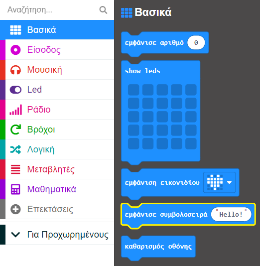

Μπορείς να εμφανίσεις λέξεις (που ονομάζονται **συμβολοσειρές** στους υπολογιστές) στα LED του micro:bit.

Οι λέξεις θα κυλήσουν από δεξιά προς τα αριστερά.

**Συμβουλή:** 💡 Οι λέξεις μετακινούνται πολύ αργά, οπότε φρόντισε να κρατάς τα μηνύματά σου σύντομα!

Μπορείς να βρεις το μπλοκ `εμφάνισε συμβολοσειρά`{:class='microbitbasic'} στο μενού `Βασικά`{:class='microbitbasic'} στην Εργαλειοθήκη σου.

Άλλαξε το κείμενο στο μπλοκ `εμφάνισε συμβολοσειρά`{:class='microbitbasic'} σε ό,τι θέλεις να εμφανίζεται.

**Συμβουλή:** 💡 Μπορείς να εμφανίσεις τα περιεχόμενα μιας 'μεταβλητής'{:class='microbitvariables'} (εφόσον είναι συμβολοσειρά). Απλώς σύρε τη μεταβλητή στο κείμενο στο μπλοκ `εμφάνισε συμβολοσειρά`{:class='microbitbasic'}.
