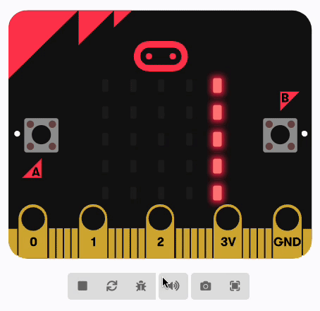

You can display words (called a **string** in computing) on the micro:bit's LEDs. 

The words will scroll across from right to left.

**Tip:** 💡 The words scroll very slowly, so make sure to keep your messages short!

You can find the <code style="background-color: #1E90FF">show string</code> block in the <code style="background-color: #1E90FF">Basic</code> menu in your Toolbox.

Change the text in the <code style="background-color: #1e90ff">show string</code> block to whatever you would like to display.

**Tip:** 💡 You can display the contents of a <code style="background-color: #DC143C">variable</code> (as long as it is a string). Just drag the variable onto the text in the <code style="background-color: #1e90ff">show string</code> block.
