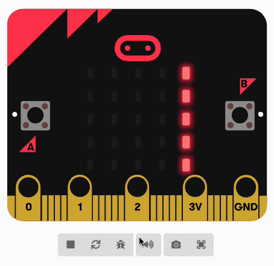
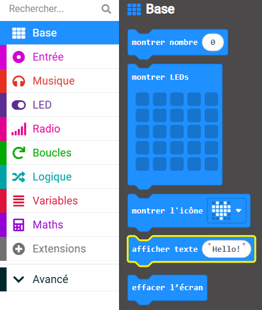

Tu peux afficher des mots (appelés **chaîne** en informatique) sur les LED du micro:bit.

Les mots défileront de droite à gauche.

**Astuce :** 💡 Les mots défilent très lentement, alors assure-toi de faire des messages courts !

Tu peux trouver le bloc `afficher texte`{:class='microbitbasic'} dans le menu `Base`{:class='microbitbasic'} dans ta boîte à outils.

Modifie le texte du bloc `afficher texte`{:class='microbitbasic'} par ce que tu souhaites afficher.

**Astuce :** 💡 Tu peux afficher le contenu d'une `variable`{:class='microbitvariables'} (à condition qu'il s'agisse d'une chaîne). Fais simplement glisser la variable sur le texte dans le bloc `afficher texte`{:class='microbitbasic'}.
