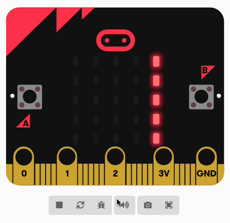
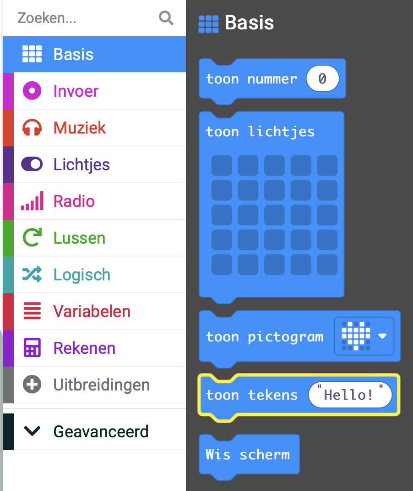

Je kunt woorden (in de computerwereld wordt dat een **string** genoemd) weergeven op de LED lichtjes van de micro:bit.

De woorden scrollen van rechts naar links.

**Tip:** 💡 De woorden scrollen heel traag, dus zorg ervoor dat je berichten kort zijn!

Je kunt het `toon tekens`{:class='microbitbasic'} blok vinden in het `Basis`{:class='microbitbasic'} menu in je Toolbox.

Wijzig de tekst in het 'toon tekens' {:class='microbitbasic'} blok naar wat je wilt weergeven.

**Tip:** 💡 Je kunt de inhoud weergeven van een `variabele`{:class='microbitvariables'} (zolang het maar een tekst is). Sleep gewoon de variabele naar de tekst in het blok 'toon tekens'{:class='microbitbasic'}.
